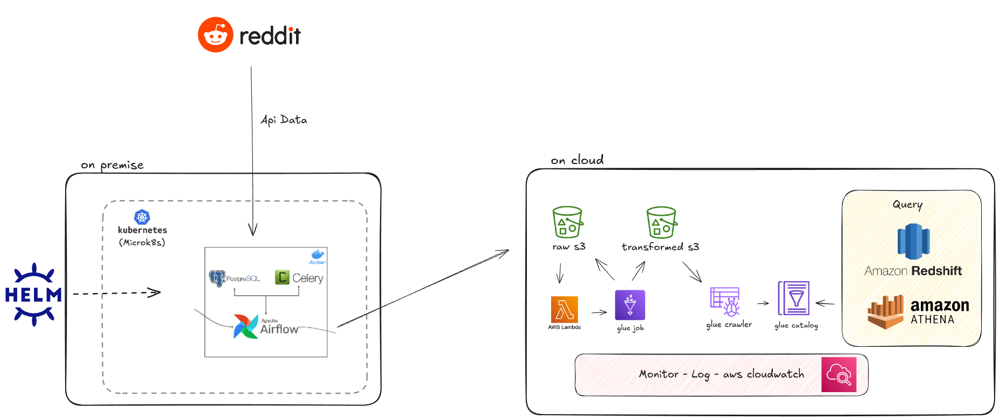
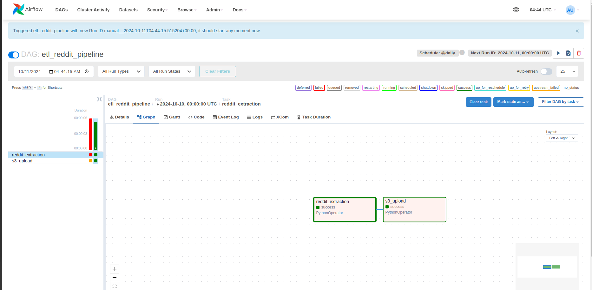
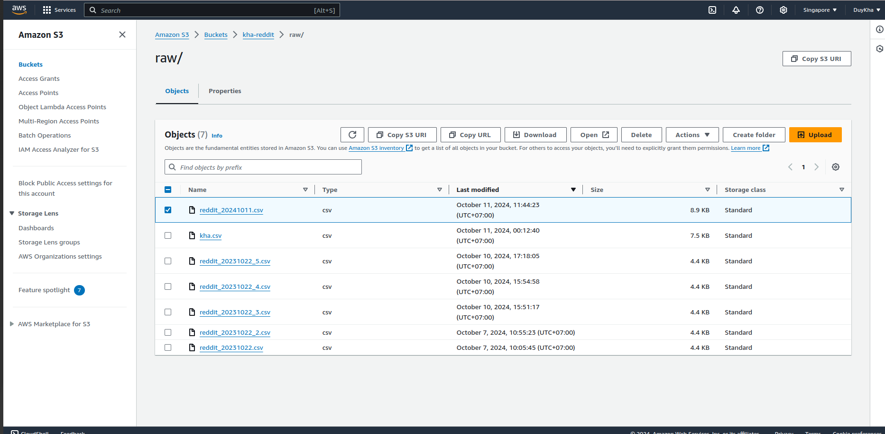
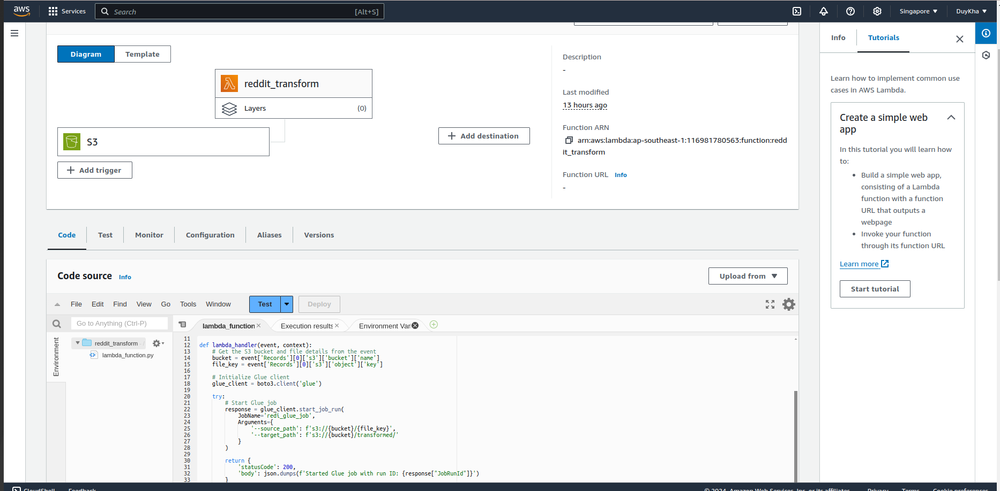
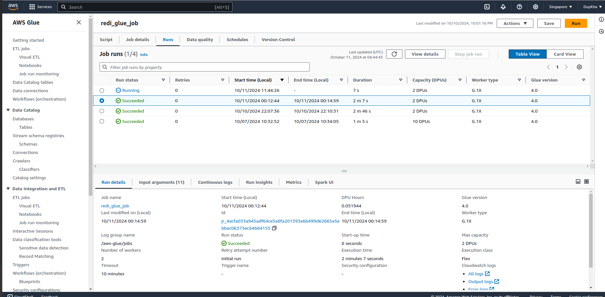
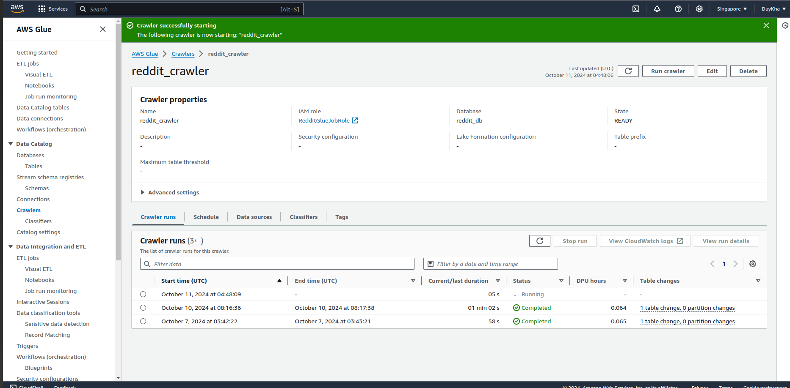
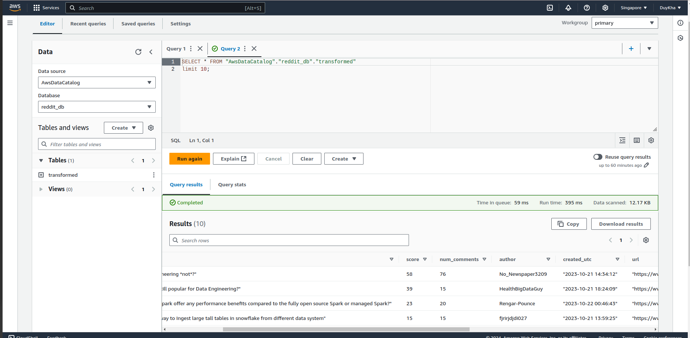
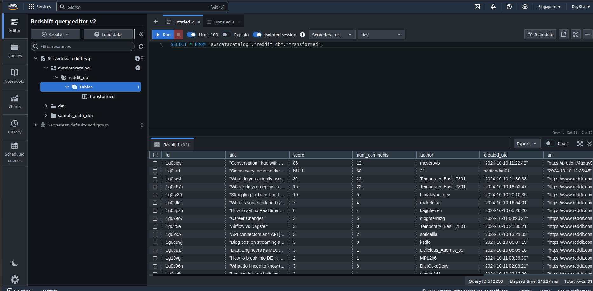
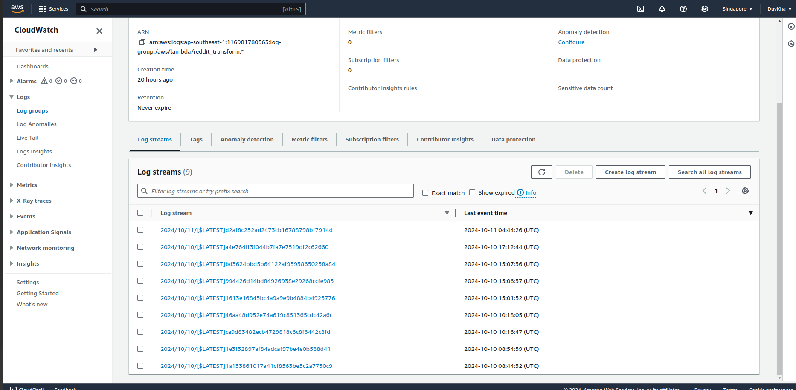

# Data Platform Project (reddit data pipeline)

## Overview
This project implements an automated data pipeline that fetches data from APIs, processes it, and makes it available for analysis using various AWS services. The pipeline is orchestrated using Apache Airflow running on Kubernetes (microk8s).

#### Technical details
I am developing a project that uses Kubernetes (microk8s), Helm, and Docker to deploy an Airflow job that retrieves data from an API, extracts it, and uploads it to Amazon S3. Once the data is uploaded to S3, it triggers an AWS Lambda function to invoke a Glue job for data transformation. We then use Glue Crawler, Athena, and Redshift for querying, and employ CloudWatch for log monitoring.


## Architecture
```
API → Airflow (K8s, Microk8s, Helm chart) → S3 → Lambda → Glue Job → Glue Crawler → Athena/Redshift
```




## Technologies Used
- **Kubernetes (microk8s)**: Container orchestration
- **Helm**: Package manager for Kubernetes
- **Docker**: Containerization
- **Apache Airflow**: Workflow orchestration
- **AWS Services**:
  - S3: Data storage
  - Lambda: Serverless compute
  - Glue: ETL jobs and data catalog
  - Athena: SQL queries on S3 data
  - Redshift: Data warehouse
  - CloudWatch: Monitoring and logging

## Prerequisites
- Kubernetes cluster (microk8s)
- Helm
- Docker
- AWS Account with appropriate permissions
- Python 3.x

## Installation

### 1. Setup Kubernetes (microk8s)
```bash
# Install microk8s
sudo snap install microk8s --classic

# command for reset and fix bug
microk8s enable dns storage helm3
microk8s enable helm3
microk8s enable dns
microk8s enable hostpath-storage
microk8s enable storage
chmod 600 ~/.kube/config
microk8s config > ~/.kube/config

microk8s kubectl delete all --all -n airflow
microk8s kubectl delete namespace airflow

sudo microk8s reset
sudo microk8s refresh-certs -e  ca.crt
sudo microk8s refresh-certs -e  server.crt
sudo microk8s refresh-certs -e  front-proxy-client.crt

#microk8s
microk8s kubectl get all -A
microk8s enable dns
microk8s enable hostpath-storage

sudo snap alias microk8s.kubectl kubectl
```

### 2. Deploy Airflow using Helm
```bash
# Add Apache Airflow Helm repository
helm repo add apache-airflow https://airflow.apache.org

# Install Airflow
helm install airflow apache-airflow/airflow

docker build -t custom-airflow:latest -f ./deployments/airflow/dockerfile .
docker tag custom-airflow:latest duykha0205/custom-airflow:latest
docker push duykha0205/custom-airflow:latest

helm pull apache-airflow/airflow
tar -xvzf yourfile.tgz

kubectl create namespace airflow
helm install  airflow ./deployments/airflow -f ./deployments/airflow/values.yaml -n airflow
kubectl port-forward svc/airflow-webserver 8080:8080 --namespace airflow

helm install  airflow ./airflow -f ./airflow/values.yaml -n airflow
helm install  airflow ./deployments/airflow -f ./deployments/airflow/values.yaml -n airflow
helm upgrade  airflow ./airflow -f ./airflow/values.yaml -n airflow
helm uninstall airflow -n airflow 

# command check bug container
microk8s kubectl port-forward -n kube-system service/kubernetes-dashboard 10443:443
microk8s kubectl port-forward -n airflow service/airflow-webserver 8088:8080
microk8s kubectl exec pod/airflow-webserver-548654c6c9-rzv4n -n airflow -i -t -- bash


```

### 3. Configure AWS Services
- Set up S3 bucket
- Configure Lambda function
- Set up Glue jobs and crawler
- Configure Redshift cluster
- Set up CloudWatch logging

### 4. Reddit api
```bash
https://old.reddit.com/prefs/apps/
```


## Output

### Airlfow


### S3 upload


### Lambda and S3


### Glue Job


### Glue Crawler


### Athena


### Redshift


### CloudWatch



## Configuration
1. Update `helm/values.yaml` with your specific configurations
2. Set up necessary AWS credentials
3. Configure Airflow connections for AWS services
4. Set up environment variables

## Usage
1. Deploy the Airflow DAGs
2. Monitor pipeline execution through Airflow UI
3. Query processed data using Athena or Redshift
4. Monitor logs in CloudWatch

## Monitoring
- Use CloudWatch for monitoring logs and metrics
- Access Airflow UI for workflow monitoring
- Check AWS Console for service-specific monitoring

## Troubleshooting
Common issues and their solutions:
1. Pipeline failures: Check CloudWatch logs
2. Kubernetes issues: Use `microk8s kubectl` commands
3. Airflow task failures: Check Airflow logs

## Contributing
1. Fork the repository
https://github.com/airscholar/RedditDataEngineering

## License
[No]

## Contact
duykha0205@gmail.com